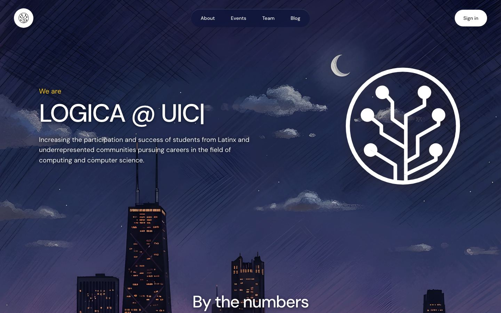
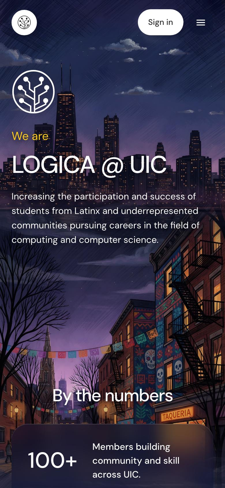
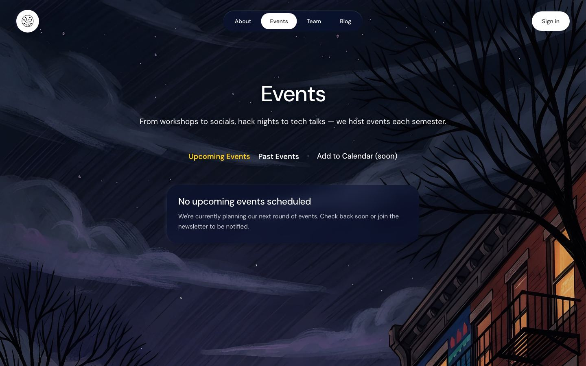
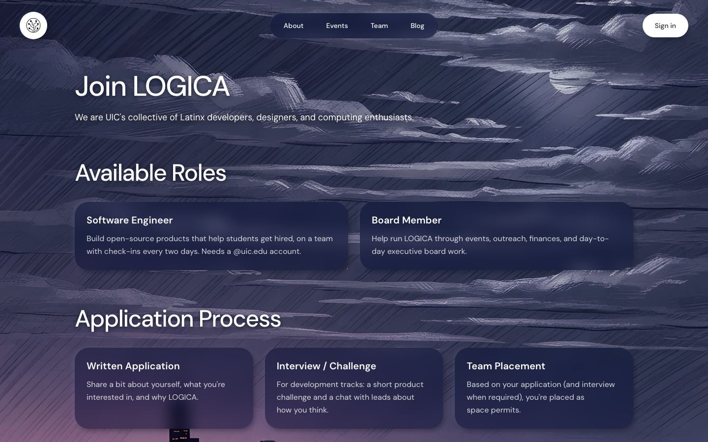
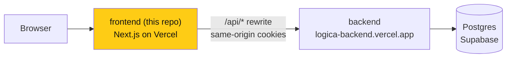

# LOGICA @ UIC — frontend

> **Owner:** [@nicolasrufino](https://github.com/nicolasrufino) · **Last reviewed:** Sep 29, 2026 · **Audience:** Members and recruiters · **Type:** Landing page

[](https://nextjs.org/) [](https://react.dev/) [](https://tailwindcss.com/) [](https://logicauic-logica5.vercel.app)

The club website for [LOGICA @ UIC](https://github.com/uic-logica) — Latinx and underrepresented students in computing at the University of Illinois Chicago. **[Live site →](https://logicauic-logica5.vercel.app)**

**Software lead:** Nicolas Rufino ([@nicolasrufino](https://github.com/nicolasrufino)) — owns every product, sets deadlines, reviews and merges. Public repo, **members-only contributions** ([how we work](https://github.com/uic-logica/.github/blob/main/CONTRIBUTING.md)).

 

## What's live

| Area | What it does |
|---|---|
| Public site | Home, About, Events, Team, Blog, Join, Partner, legal pages — one night painting of Chicago per page |
| Accounts | Sign up with @uic.edu, password sign-in, 30-day sessions |
| Member dashboard | Overview, profile (resume + LinkedIn), events and check-in, engagement, community, **Software Teams** application |
| Exec workspace | Money, outreach pipeline, insights, documents, members, applications |
| Speakers & guests | `/speak` intake, guest portal, availability calendar |

 

## How it fits together



Browser calls stay same-origin (`src/lib/api.ts`); `next.config.ts` forwards `/api/*` to `NEXT_PUBLIC_API_URL`, so session cookies stay first-party.

## Run it locally

```bash
npm ci
cp .env.example .env.local    # NEXT_PUBLIC_API_URL=http://localhost:3001
npm run dev                   # http://localhost:3000
```

Before launch, set `SITE_URL` to the final HTTPS origin and rebuild (sitemap, Open Graph and share image use it).

Run the [backend](https://github.com/uic-logica/backend#readme) on port 3001 at the same time. Before a PR: `npm run lint` · `npx tsc --noEmit` · `npm test`.

## Where things are

| Path | What |
|---|---|
| `src/app/` | Routes: public pages, `signin`, `signup`, `dashboard/[section]`, `speak`, `invite` |
| `src/components/club/` | Public shell, nav, night backdrop (`JourneyBackdrop.tsx`) |
| `src/components/dashboard/` | Dashboard shell and every section (`Dashboard.tsx`, `BuildTeams.tsx`, `Board.tsx`, …) |
| `src/lib/` | API client and pure helpers (with vitest tests) |
| `design/logica.pen` | The design — "Variant E (night)" frames, open in [Pencil](https://pen.dev) |
| `docs/screenshots/` | Live screenshots used here |

## Design

The night design in [`design/logica.pen`](design/logica.pen) and [DESIGN.md](DESIGN.md) is the only spec. New screens get designed there first.

## Known gap

`/events` still shows "Add to Calendar (soon)" as text.

Docs for contributors: [AGENTS.md](AGENTS.md) (rules for code changes) · [PRODUCT.md](PRODUCT.md) · [DASHBOARD.md](DASHBOARD.md) · [CONTENT.md](CONTENT.md) · [roadmap](https://github.com/uic-logica/.github/blob/main/ROADMAP.md).
